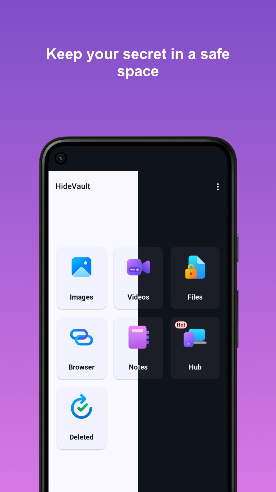
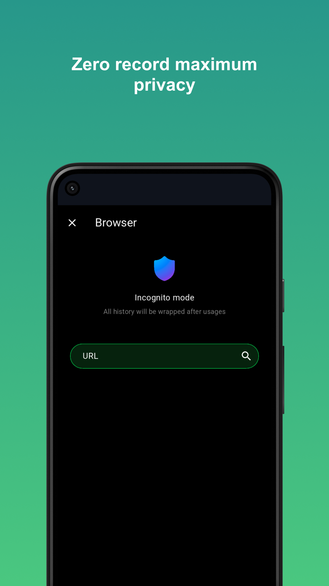
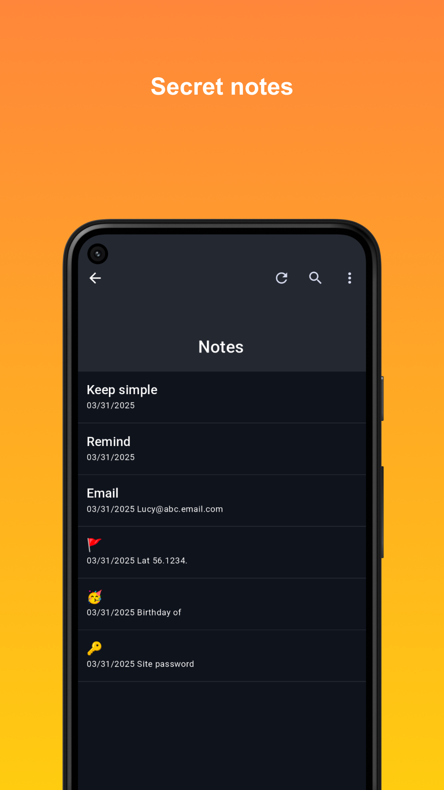
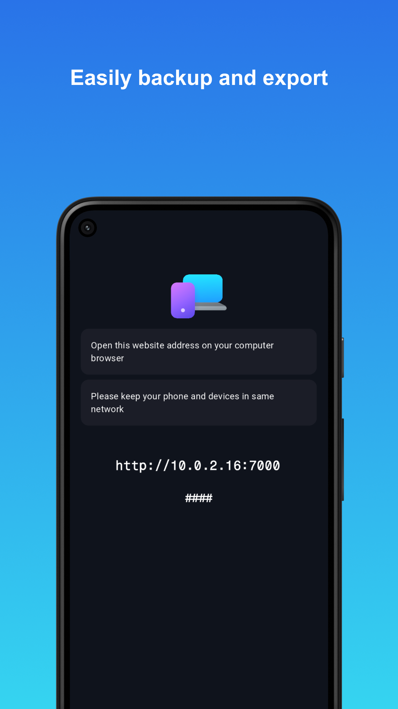

# AppHideVault

[PrivacyPolicy]('pp.html')  |  [Terms of uses]('terms.html')

## About

HideVault is app designed for hide photos/images and other files on your device.

## Feature

- ✅ hide photos
- ✅ hide vidoes
- ✅ hide all kinds of files
- ✅ privacy safe browser
- ✅ secret notes
- ✅ hub for connecting through browser

## Screenshots

## Download

TBD
